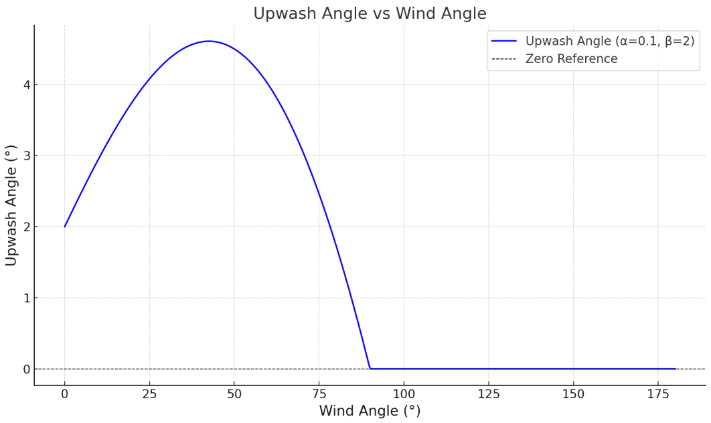

# Advanced wind  Plugin for SignalK

## Function and goal of the plugin
The Advanced wind plugin is a plugin for SignalK server that calculates true wind from wind sensor data  and peddle wheel data. It also calculates ground wind using wind sensor data using GPS and compass data.

The goal of the plugin is to supply the best possible approximation of wind speed. To improve the wind speed calculation the plugin can make several corrections. Each individual correction is optional and most can be parameterised. The plugin can therefore be tuned to the boats characteristics. The corrections will be discussed in more detail later on.

## About wind
Wind is the driving force of a sailing vessel. Therefore reliable wind information is important to all sailors. For performance sailors and racers this if even more true as reliable wind information allows them to compare the performance of their vessel to a maximum theoretical performance given in theis vessels polar data.
Wind has to important elements: speed and direction. Another important aspect is the frame of reference from which the wind is experienced. Wind seems stronger  on a moving vessel than on a anchored vessel. There are three commonly known frames of reference when dealing with wind. The first frame of reference is the vessel itself, this is the wind as it is perceived by a person on the vessel. This is commonly called the apparent wind. The second frame of reference is the wind as it would be perceived from an object floating on the water. This wind is called wind over water or true wind. The third frame of reference is the ground. This is the wind one would feel standing on a small island in the water. This is called wind over ground or ground wind. 
Each of these three winds are important to a sailor, although for different reasons:
- Apparent wind is important for trimming the sails. 
- True wind is important for determining when to tack or gibe. 
- Ground wind is important to predict the wind after the tide changes or to interprete weather forecasts.

The relation between the three different winds is as follows:
- Wind over water (true wind) = wind over ground + current
- Wind on the vessel (apparent wind) = Wind over water + vessel speed

These relations make it possible to convert one kind of wind to another. These conversions form the basis of the plugin.

There are in fact two other frames of reference that are relevant to the plugin. One is the mast as the mast moves in respect to the vessel on a rocking boat. The other is the wind sensor as the wind sensor can be misaligned in respect to the vessel.  

## The corrections and calculations
The plugin calculates the different winds going from one frame of reference to the other, starting with the wind measured by the sensor. In each frame of reference corrections might be applied. The order of calculations is to go from wind sensor to mast to vessel to water to ground. To distighish between the frames of reference we will uses sensor_wind, mast_wind, vessel_wind, water_wind and ground_wind when discussing the calculations and corrections.Furthermore, when we are talking specifically about wind speed ore wind angle we will use sensor_wind_speed or sensor_wind_angle etc.

### Going from sensor to mast, Sensor misalignment correction
To calculate the mast_wind from the sensor_wind the plugin substracts the sensor misalignment from the sensor_wind_angle. 
For this correction the plugin uses the plugin parameter sensorMisalignment that can be set in the plugin options.

### Going from mast to vessel, Mast heel correction
A wind sensor measures wind speed in a plane. When the mast is upright the sensor measures wind speed in a plane parallel to the surface of the earth. This is also how the wind blows, so the sensor measures all of the wind. When the boat and sensor are tilted then the plane in which the wind is measured is tilted too. The wind not only blows sideways on the sensor but also a bit from above or below. However, as the sensor is blind to the vertical part of the wind, it will only measure a portion of the wind. The wind speed will be underestimated. Knowing the tilt angle of the sensor the plugin can correct for this using the formula vessel_wind = mast_wind / cosine (mast angle).
For this correction the plugin uses the path vessel.attitude.

### Going from mast to vessel, Mast movement correction
As a vessel rolls due to wind and waves the wind sensor mounted in the mast moves in respect to the vessel. This movement adds to the windspeed a sensor experiences. To correct for this the plugin calculates this movement and substracts it from the mast_wind. 
The calculation of mast movement is based on the attitude change of the vessel and the height of the sensor in the mast.
For this the plugin uses the path vessel.attitude and plugin parameter sensorHeight.

### Going from mast to vessel, Mast rotation correction
Some vessels have rotating masts, in this case the wind_angle has to be corrected for this rotation by substracting the mast rotation form the wind angle, vessel_wind_angle = mast_wind_angle - mast rotation.
SignalK does not have a defined path for mast rotation. The path to use has to be specified in the plugin setting.

### Going from mast to vessel, Upwash correction
The sails of a vessel do bend the wind, A phenomena that is called upwash. The wind angle measured by the wind sensor can to be corrected for this. The amount of upwash depends on the sailplan, on the position of the sensor and on the wind angle. Upwash can not be measured but it can be estimated. The plugin uses this formula to estimate upwash: Upwash Angle (°) =  (α ⋅ wind_angle(°) + β(°)) ⋅ max(0, cos(wind_angle)).
In this formula alpha and beta are parameters that can be set in the plugin options.

### Going from vessel to water, Leeway correction
The wind not only pushes a boat forward but also a bit sideways to leeward. This effect is called leeway. Most speed sensors only measure forward speed of the vessel and leeway is ignored. But to properly calculate water_wind leeway should be taken into account. 

The boat speed is ten corrected for leeway, boat_speed_angle  = boat_speed_angle + leeway.
This correction uses the path navigation.leewayAngle. (Leeway can be estimated by Derived Data plugin or by Speed and Current plugin).

### Going from vessel to water, boat speed correction
To calculate water_wind, commonly known as true wind, the plugin substracts vessel speed from the wind, water_wind = vessel_wind - boat_speed. 

### Going from vessel to water, mast height correction
Wind speed increases with height, an effect called wind gradient. to get wind speed that is comparable between vessels and with boat speed polar data the plugin normalises wind speed to a height of 10 meters, this being the value that is used both in polars and in weather forecasts. The wind gradient depends on factors like the smoothness of the water surface and the temperature difference between wind and water. The gradient is estimated using the formula: Wind gradient = (10 / sensor height above water)^α. Where alpha is a parameter that can be set in the plugin settings. The gradient is a factor that is applied to the wind speed using: water_wind_speed = water_wind_speed * gradient.

## Outputs

### True wind
The calculated water_wind (or true wind) is written to the paths environment.wind.speedTrue and environment.wind.angleTrueWater.

### Going from water to vessel, applying all corrections to the apparent wind
To apply the corrections to apparent wind too, it can optionally be back calculated from the true wind: vessel_wind = water_wind + vessel speed. The resulting apparent wind has all the corrections that are done when calculating true wind, except for the leeway correction.
The backcalculated apparent wind is written to the paths environment.wind.speedApparent and environment.wind.angleApparent. The result will be two diffent values the apparent wind paths, the back calculated one will have aa source advancedwind.XX. To prevent having two values for apparent wird the plugin can optionally filter out the original wind data.

### Going from vessel to ground
Ground wind effectively is wind over water corrected for current. However current can not be measured directly. Therefore, ground wind is calculated in different way, using speed over ground and heading of the vessel. Ground_wind = vessel_wind - ground speed; ground_wind_angle - ground_wind_angle - heading.
To calculate ground speed the plugin uses the paths environment.wind.speedOverGround,  environment.wind.directionTrue and navigation.headingTrue.
Ground speed is written to the paths navigation.speedOverGround and navigation.courseOverGroundTrue.

## oversampling and smoothing
The plugin allows for over sampling of data. If some data comes in more frequently than wind data it can be averaged over time. This will result in better and smoother data. One can specify the time constant use for input smoothing. All inputs are smoothed using the same time constant. A time constant of 0 will result in no smoothing at all.

## Inspection the effect of calculations and corrections
The plugin comes with a webapp for Signalk that shows a graph of all the speed and wind vectors in play and a breakdown of every individual calculation in real time. This way one can easily see what is going on. Read more about the webapps in [link test](public/README.md).

## Some considerations
- Some wind sensors or instrument systems are able to apply heel correction or mast movement correction. In that case make sure that the same corrections is not made twice.
- Corrections increase the quality of the wind data. But they also can increase the noise level of the data, the fluctuations in corrected wind data might under some circumstances be bigger than in uncorrected data.
- Good quality boat speed is essential for calculating wind over water. Take time to calibrate the paddle wheel or use the Speed and Current plugin to automatically correct boat speed.
- Good quality heading is essential for calculating wind over ground. Take time to calibrate the compass.
- Use the graph from the webapp to get an impression of the quality of your boat speed and heading data. Ground speed and boat speed should be the same when there is no current. The direction of ground wind does not change after tacking when the compass is calibrated and the wind sensor is aligned.

