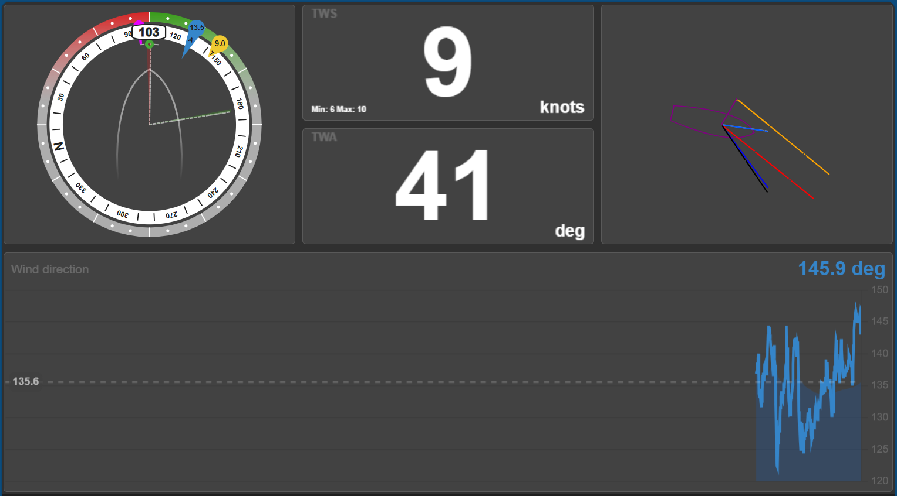

# Advanced wind webapp for SignalK

## Function and goal of the webapp
The Advanced wind webapp accompanies the Advanced wind plugin. Its function is to provide insight in the calculations made by the webapp. This makes it possible for a user to see the effect of the different calculations and corrections and thereby to tweak them. The webapp provide insight in two different ways:
- A real time graphical representation of all the wind and vessel vectors that are involved
- A real time numerical representation of each unput used and the result of each individual calculation that is made by the plugin.

## The wind and vessel speed graph
This graph shows the speed and direction of both the vessel and the wind and the tilt angle of the vessel.Wind and vessel vectors are only included in the graph when they are used and available as input or are calculated by the plugin. The behaviour of the plugin is controlled by its settings.

The following elements can be seen in the graph:
- The vessel and the mast are shown in purple. The mast is no more then a dot when the vessel is perfectly level but it will become a line segment when the vessel is tilted. It is as if one is looking at the vessel from above.
- The speed of the sensor in respect to the vessel is represented as the small green vector that originates from the mast top.
- The wind speed as measured by the sensor is shown in orange. It originates from the mast top.
- The speed of the vessel through the water is shown in light blue. If leeway is used then the vector will indicate this by being slightly off centered from the vessel.
- The speed of the vessel over ground is shown in gray.
- The apparent wind is shown in red.
- The wind over water (often called true wind) is shown in dark blue.
- The wind over ground is shown in black.

The vectors have markings indicating speed. For low speeds there is a marking for every knot and a double marker each five knots. For highter speeds there is a marker for every 5 knots of speed and a double marker every tenth knot.

The wind and vessel speed graph can be embedded in other HTML pages. To embed embed the graph in @mxtommy/KIP use a "component/embedded webpage" and set the url to /advancedwind/vectors.html .

## The calculations page
This page shows real time the value of all the input paths and the results of each calculation. I hope this is self explainatory.

